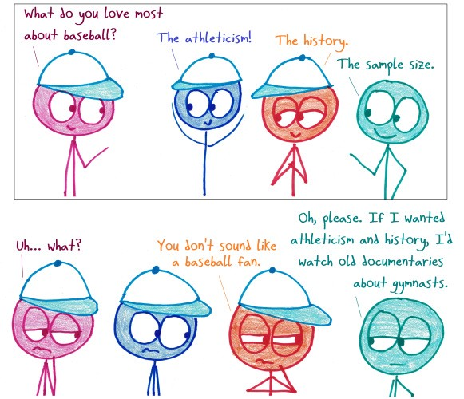

```{r, echo=FALSE, include=FALSE, warning=FALSE}
library(tidyverse)

library(janitor)


left_path <- "data/Splits Leaderboard Data vs LHP.csv"

right_path <- "data/Splits Leaderboard Data vs RHP.csv"

data_left <- read_csv(left_path) %>% clean_names()

data_right <- read_csv(right_path) %>% clean_names()

```

<!-- Lockout. The time of the year where your significant others and friends, who do not enjoy baseball, can get a little more time with you, fellow reader. -->

<!-- Well, we are here to fix that -->

<!-- We had a full season! Just that already brings me joy, even if it was still Covid impacted. We had cases, we had vaccination issues and we had injuries. But we also had one full season of data again. No more 60 game season -->

What a year for baseball, folks. After a dreadful, but necessary, 60-game season in 2020, we got our long awaited full 162-game season and nothing brings more join to an analytics person than a nice sample size. 
<br>


We can now dig deeper on what we saw or did not see last year. We can go through the data, or splits of it which is my case, and check out what happened. Who was good? When were they good? Against whom? That is what we are going to try to figure out here and, hopefully, give you some ideas to build your fantasy roster, stream some guys or just have fun reading it. So let's dive in!

Splitting last year's data for hitters against left-handed pitchers (LHP) and right-handed pitchers (RHP), let's see if we can find out who were the best hitters against each kind of pitcher based on On-base Plus Sluggins (OPS) and Weighted Runs Created Plus (wRC+).

## Against LHP (OPS > 1 and wRC+ > 150)

I know. Those are insane numbers, but some guys were there and a feel went above and beyond to be elite against LHP - and I mean ELITE. Only 17 guys were able to perform like that. Can you guess some of the top 5 names?

```{r echo=FALSE, include=TRUE, warning=FALSE}

players_to_hide <- c('Mike Zunino', 
                     'Luis Robert', 
                     'Ketel Marte',
                     'Teoscar Hernandez',
                     'Trea Turner')
data_left %>% 
  filter(ops > 1 & w_rc_2 > 150) %>% 
  mutate(name = if_else('Mike Zunino' == name, 'Player 1', name),
           name = if_else('Luis Robert' == name, 'Player 2', name),
           name = if_else('Ketel Marte' == name, 'Player 3', name),
           name = if_else('Teoscar Hernandez' == name, 'Player 4', name),
           name = if_else('Trea Turner' == name, 'Player 5', name),
    ) %>% 
  ggplot(aes(x = ops, y = w_rc_2)) +
  geom_point(aes(color = name, size = pa, colour = name))+
  geom_text(aes(label = name, size = 90))+ 
  guides(colour="none", size = guide_legend(title="PA"))+
  ylab('wRC+')+
  xlab('OPS')
# Mike Zunino
# Ketel Marte
# mutate(name = if_else(name %in% players_to_hide, )) 'Player ' + match(name, players_to_hide)
```

### Mike Zunino (OPS: 1.287 wRC+: 242.47 Pa: 129)

No. That is not a typo. Zunino got a 242.47 wRC+ against LHP. That means he produced 142% more runs than an average MLB player when hitting lefties. To put things in perspective, Vladdy, who was going for a triple crown last year, got a 155.8 wRC+ in 173 Pa. That is 55.8% more runs than league average, which is good, but it is not even close to Zunino's numbers. He was a *beast* against lefties slashing 0.342/0.418/0.868 with 16 HR. If he is free on your league, I would totally stash him, or even start him. He can be a total asset when the Rays face left-handed pitching this season. Oh, and let's not forget he led
the league last season with 24.3 barrel%.

### Luis Robert (OPS: 1.235 wRC+: 230.63 Pa: 68)

I know, I don't like the 68 plate appearances either, but if it is good enough for Fangraphs to include in this data split, it is good enough for me.
Robert slashed 0.396/0.441/0.793 with 6 HR against lefties last year. The small sample takes a little of the confidence on those numbers for sure, but we also have to remember that this is only his second season in the majors, and it would have been the first full season if not for the injuries he faced. If he can have a full season maintaining his health, what does not seem to be a problem, we can expect regression, but still awesome numbers from him against LHP this year.

### Ketel Marte (OPS: 1.171 wRC+: 202.34 Pa: 115)

It's not 2019 numbers. A small sample looks good on Marte, right? Playing only 90 games due to injury, Marte was incredible against LHP. The switch hitter slashed .387/.435/.736, which is not even close to what he did against RHP. Next to the two guys above he may not seem that impressive, but believe me, being able to produce 102% more runs than an average league average player is something. A guy with these numbers at one side of the plate and second-base eligibility can really help some folks out there, and we have already seem what he can do in a full season.

### Teoscar Hernández (OPS: 1.151 wRC+: 202.66 Pa: 140)

Almost 77% of Hernández's plate appearances were against RHP (455), but when he faces lefties it is hard to stop this man. He slashed .372/.407/.744 with 12 HR against left-handed pitching and the best of all: he is getting better. He had an incredible 2020 season smashing 16 HR in 50 games against both sides and in 2021 he was able to keep his elite numbers very close to the previous year while improving his K% from 12 to 26 percentile across the league. Safe to say, Hernández has an elite bat and if he can get more Pa against left-handed pitchers, his value can go even higher.

### Trea Turner (OPS: 1.149 wRC+: 201.18 Pa: 167)

This is a guy who needs no introduction I believe. He slashed .392/.437/.712 against southpaws last year with 11 HR. Turner is an incredible asset for fantasy with his combination of power-speed that is hard to match, but apparently, there is a catch. He only runs with righties on the mound. Out of his 32 stolen bases last year, he only attempted to steal 6 times against lefties with 2 caught stealings. This obviously don't affect his value as a hitter, but it is a nice fun fact because there is not much to say about Turner, except that he is good hitter and even a better one against opposite-hand pitchers.

## Against RHP (OPS > 0.950 and wRC+ > 150)
Now from the other side of the throwing arm, things get a little more interesting. Most of them are expected, a bit more plate appearances, OPS is fifty points low because we had only seven hitters with the same parameters from before, but we still have the same amount of fun. Check it out!

```{r echo=FALSE, include=TRUE, warning=FALSE}

players_to_hide <- c('Mike Zunino', 
                     'Luis Robert', 
                     'Ketel Marte',
                     'Teoscar Hernandez',
                     'Trea Turner')
data_right %>% 
  filter(ops > 0.950 & w_rc_2 > 150) %>% 
  mutate(name = if_else('Bryce Harper' == name, 'Player 1', name),
           name = if_else('Juan Soto' == name, 'Player 2', name),
           name = if_else('Jesse Winker' == name, 'Player 3', name),
           name = if_else('Joey Votto' == name, 'Player 4', name),
           name = if_else('Vladimir Guerrero Jr.' == name, 'Player 5', name),
    ) %>% 
  ggplot(aes(x = ops, y = w_rc_2)) +
  geom_point(aes(color = name, size = pa, colour = name))+
  geom_text(aes(label = name, size = 200))+ 
  guides(colour="none", size = guide_legend(title="PA"))+
  ylab('wRC+')+
  xlab('OPS')
# Mike Zunino
# Ketel Marte
# mutate(name = if_else(name %in% players_to_hide, )) 'Player ' + match(name, players_to_hide)
```


### Bryce Harper (OPS: 1.155 wRC+: 193.03 Pa: 409)

An MVP is an MVP for a reason and Harper showed us why when he was hitting against RHP. With almost 13 points of wRC+ from the second guy, Harper had a .333/.444/.711 slash line with 31 HR out of his 35 coming against thins kind of pitcher. 

More plate appearances mean we can trust more on what we see from these guys, and we can really enjoy what Harper is able to do, especially if you are on an OBP league, where he will for sure help you there. Only at 29 years old and two MVP awards, Harper is one of my favorite outfielders to aim at drafts, even though I rarely get to him. He can get you power against right-handed pitchers and at the same time, he gets on base in an elite level lot from both sides.

### Juan Soto (OPS: 1.073 wRC+: 180.84 Pa: 416)

Do good hitters have great plate discipline or who has great plate discipline is a great hitter? There may be an article out there, but for now, we can just be marvelous by what Soto was able to provide against RHP. Soto slashed .333/.500/.573 last season. (I had to pause here for a second because a .500 OBP in 416 plate appearances is absolutely insane!)

If you are looking for a solid guy, Soto is the one for you. Entering his fifth season in the big leagues, the 23-year-old will give you the numbers. What he lacks in power compared to Harper's performance last season, he can overcome with volume, elite plate discipline, a little bit of pop, and a secure production in runs and RBIs.

Soto may lack the slugging that we have seen so far in this article, but in the same line of thought, it is also incredible that he is here without it!

### Jesse Winker (OPS: 1.069 wRC+: 177.59 Pa: 367)
Winker is the kind of guy I thought would show up more on this split, but it hasn't happened so far. Until now.

Batting almost 75% of his plate appearances against RHP, the 28-year-old will help your team as he did last year slashing .346/.428/.642 with 21 HR and a 70-plus combination of runs and RBIs. However, do not trust him against pitchers throwing from the other side.

Against LHP Winker slashed .176/.288/.284 in 118 plate appearances and I guess we can stop this brutal comparison here.

Last year Winker showed us he will provide a nice production against righties, but that is it. He will not get you the volume of a full season worth of batted balls, but you can still enjoy a nice ride when there is an RHP on the mound.
